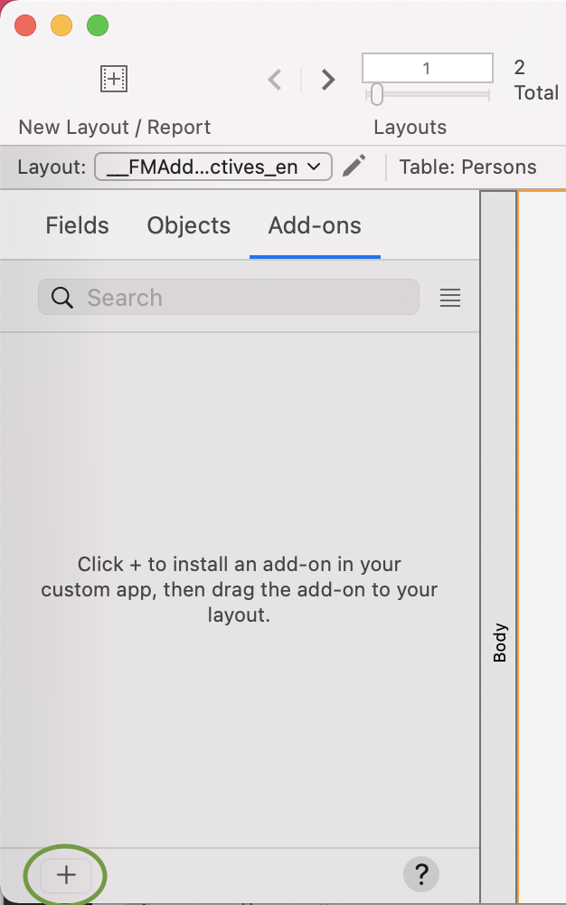

# Encoder -Addon
Purpose: Generate QR codes in your FileMaker application with this Add-On.

Inputs:
  Update the webViewer with a fieldName or calculation to generate the QR Code

Outputs:
  .gif QR Code

Dependencies:
  none

Notes: Encoder v2.0 includes a new javascript engine based on easy QR creator. This new engine inculdes many additional properties that can be adjusted to customize the QR Code.

Package Contents:

- Scripts: getQRCode
- Custom Functions: none
- Layouts: none
- Tables: none
  

# Installation Instructions:
**Place the downloaded Encoder folder in your FileMaker Add-Ons directory:**

   Mac: ~/Library/Application Support/FileMaker/Extensions/AddonModules
   
   Win: ~\\AppData\\Local\\FileMaker\\Extensions\\AddonModules

  1. Install Encoder from the Add-Ons tab in Layout Mode.
  
  
  2. Navigate to iCore, and select "Encoder" to install.
  
  3. Drag the installed AddOn to the layout to install it.
  4. Open the webviewer settings and update the qrText calculation and options

# Usage Instructions
  Once installed, Encoder generates the QR Code from the variable qrText calculation in the webViewer settings, based on the current context of the layout.
  
  Encoder automatically adjusts the size of the QR Code to the size of the webViewer.  To adjust the size of the QR Code, change the size of the webViewer.
  
  **Options:** 
  '''
  {
    // ====== Basic
    text: "https://github.com/ushelp/EasyQRCodeJS",
    width: 256,
    height: 256,
    colorDark : "#000000",
    colorLight : "#ffffff",
    correctLevel : QRCode.CorrectLevel.H, // L, M, Q, H
    
    // ====== dotScale
    /*
    dotScale: 1, // For body block, must be greater than 0, less than or equal to 1. default is 1
    
    dotScaleTiming: 1, // Dafault for timing block , must be greater than 0, less than or equal to 1. default is 1
    dotScaleTiming_H: undefined, // For horizontal timing block, must be greater than 0, less than or equal to 1. default is 1
    dotScaleTiming_V: undefined, // For vertical timing block, must be greater than 0, less than or equal to 1. default is 1
    
    dotScaleA: 1, // Dafault for alignment block, must be greater than 0, less than or equal to 1. default is 1
    dotScaleAO: undefined, // For alignment outer block, must be greater than 0, less than or equal to 1. default is 1
    dotScaleAI: undefined, // For alignment inner block, must be greater than 0, less than or equal to 1. default is 1
    */
   
    // ====== Quiet Zone
    /*
    quietZone: 0,
    quietZoneColor: "rgba(0,0,0,0)",
    */

    // ====== Logo
    /*
    logo: "../demo/logo.png", // Relative address, relative to `easy.qrcode.min.js`
    logo: "http://127.0.0.1:8020/easy-qrcodejs/demo/logo.png", 
    logoWidth: 80, // fixed logo width. default is `width/3.5`
    logoHeight: 80, // fixed logo height. default is `heigth/3.5`
    logoMaxWidth: undefined, // Maximum logo width. if set will ignore `logoWidth` value
    logoMaxHeight: undefined, // Maximum logo height. if set will ignore `logoHeight` value
    logoBackgroundColor: '#fffff', // Logo backgroud color, Invalid when `logBgTransparent` is true; default is '#ffffff'
    logoBackgroundTransparent: false, // Whether use transparent image, default is false
    */

    // ====== Backgroud Image
    /*
    backgroundImage: '', // Background Image
    backgroundImageAlpha: 1, // Background image transparency, value between 0 and 1. default is 1. 
    autoColor: false, // Automatic color adjustment(for data block)
    autoColorDark: "rgba(0, 0, 0, .6)", // Automatic color: dark CSS color
    autoColorLight: "rgba(255, 255, 255, .7)", // Automatic color: light CSS color
    */
    
    // ====== Colorful
    // === Posotion Pattern(Eye) Color
    /*
    PO: '#e1622f', // Global Posotion Outer color. if not set, the defaut is `colorDark`
    PI: '#aa5b71', // Global Posotion Inner color. if not set, the defaut is `colorDark`
    PO_TL:'', // Posotion Outer color - Top Left 
    PI_TL:'', // Posotion Inner color - Top Left 
    PO_TR:'', // Posotion Outer color - Top Right 
    PI_TR:'', // Posotion Inner color - Top Right 
    PO_BL:'', // Posotion Outer color - Bottom Left 
    PI_BL:'', // Posotion Inner color - Bottom Left 
    */
    // === Alignment Color
    /*
    AO: '', // Alignment Outer. if not set, the defaut is `colorDark`
    AI: '', // Alignment Inner. if not set, the defaut is `colorDark`
    */
    // === Timing Pattern Color
    /*
    timing: '#e1622f', // Global Timing color. if not set, the defaut is `colorDark`
    timing_H: '', // Horizontal timing color
    timing_V: '', // Vertical timing color
    */
    
    // ====== Title
    /*
    title: 'QR Title', // content 
    titleFont: "normal normal bold 18px Arial", //font. default is "bold 16px Arial"
    titleColor: "#004284", // color. default is "#000"
    titleBackgroundColor: "#fff", // background color. default is "#fff"
    titleHeight: 70, // height, including subTitle. default is 0
    titleTop: 25, // draws y coordinates. default is 30
    */
   
    // ====== SubTitle
    /*
    subTitle: 'QR subTitle', // content
    subTitleFont: "normal normal normal 14px Arial", // font. default is "14px Arial"
    subTitleColor: "#004284", // color. default is "4F4F4F"
    subTitleTop: 40, // draws y coordinates. default is 0
    */
   
    // ===== Event Handler
    /*
    onRenderingStart: undefined,
    onRenderingEnd: undefined,
    */
   
    // ===== Versions
    /*
    version: 0, // The symbol versions of QR Code range from Version 1 to Version 40. default 0 means automatically choose the closest version based on the text length.
    */     
   
    // ===== Binary(hex) data mode
    /*
    binary: false, // Whether it is binary mode, default is text mode. 
    */ 
    
    // ===== Tooltip
    /*
    tooltip: false, // Whether set the QRCode Text as the title attribute value of the QRCode div
    */
   
    // ==== CORS
    /*
    crossOrigin: null, // String which specifies the CORS setting to use when retrieving the image. null means that the crossOrigin attribute is not set.
    */
   
    // =====  Drawing method
    /*
    drawer: 'canvas' // Which drawing method to use. 'canvas', 'svg'. default is 'canvas'
    */   

}
'''
  If allow interation is enabled, the QR Code gif can be dragged directly from the webViewer.
  
  getQRCode: To get the QR Code as a variable that can be used in FileMaker programming and containers, call this script and use Get ( ScriptResult ). The script result is the data file and can be used to set a container field to the file.
  - Parameter (optional), send the Addon UUID if there is more than one Encoder on the layout.
  
